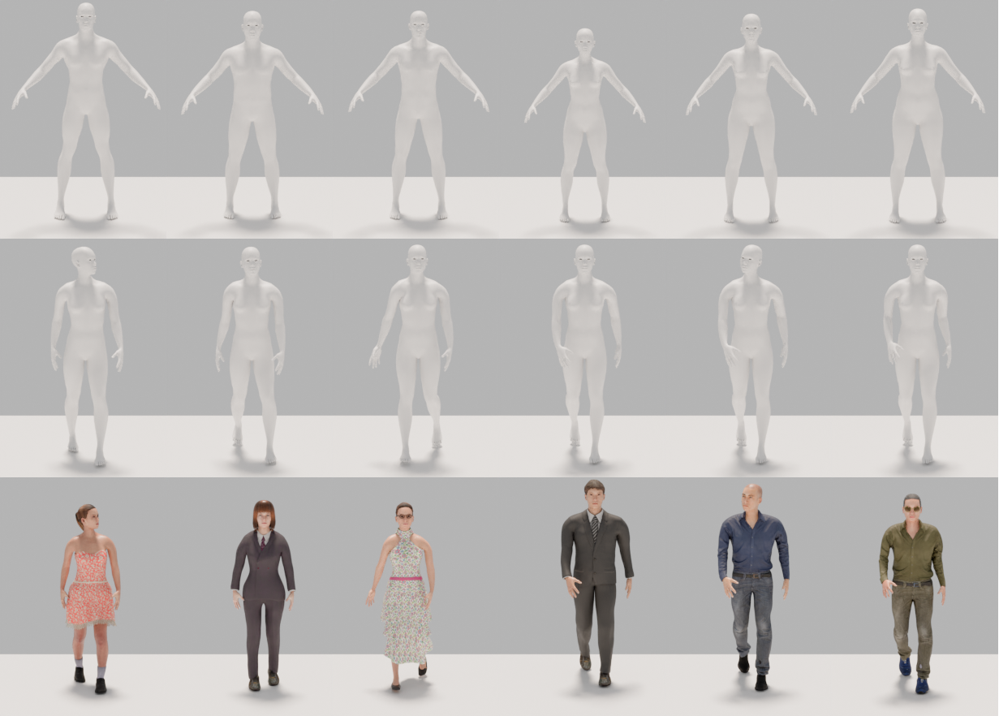
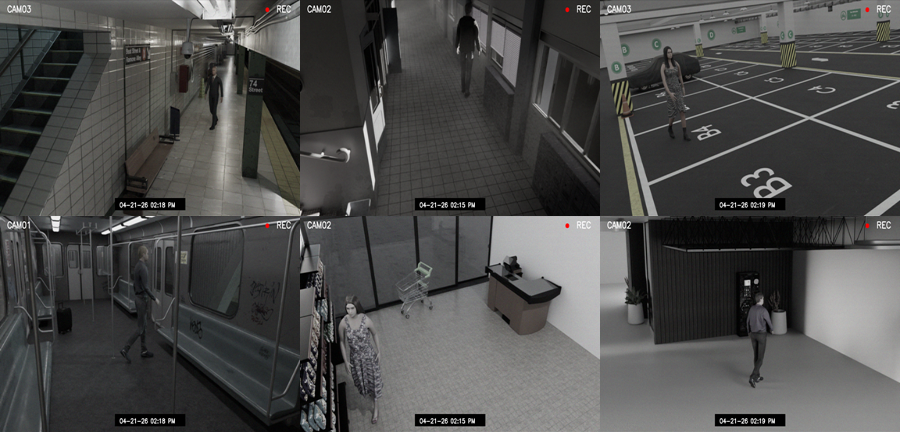

<h1 align="center"> Towards Forensic Height Estimation:
Generating Digital Humans in CCTV Environments</h1>
<p align="center">

<p align="center">
  <p align="center">
    <a href="https://dasec.h-da.de/staff/andre-doersch//"><strong>André Dörsch</strong></a>    
    ·
    <a href="https://www.ntnu.edu/employees/christoph.busch"><strong>Christoph Busch</strong></a>
    ·
    <a href="https://dasec.h-da.de/staff/christian-rathgeb/"><strong>Christian Rathgeb</strong></a>  
  </p>
  <p align="center">
  
</p>
  <h2 align="center">ICPR 2026 - V3SC Workshop</h2>
  <div align="center">
  </div>

This is the official repository of the paper: [Towards Forensic Height Estimation:
Generating Digital Humans in CCTV Environments](https://icpr2026orgteam.github.io/WSpapers/pdfs/paper_0153.pdf)


## News

### September 2026
 + HDA-DH-CCTV dataset is being made available

## Overview
<p align="center">
  
</p>

This research work supports the development of height estimation in surveillance settings by introducing HDA-Digital Humans in CCTV Environments (HDA-DH-CCTV), a synthetic dataset of digital humans rendered across various surveillance scenes.

| Category | Property | Value |
| :--- | :--- | ---: |
| **Dataset** | Total Images | 2,250 |
| | Image Resolution | 1280 × 720 |
| | Number of scenes | 9 |
| | Images per scene | 250 |
| | Subjects per image | 1 |
| | Annotated reference objects per scene | 1 |
| **Camera Configuration** | Total Camera Configurations | 27 |
| | Cameras per scene | 3 |
| | Focal length range (mm) | 19 – 59 |
| | Sensor width range (mm) | 28 – 40 |
| **Digital Humans** | Male subjects | 1,110 |
| | Female subjects | 1,140 |
| | Unique poses/gait | 8 |
| | Body height range (m) | 1.42 – 2.18 |
| | Mean ± std height (m) | 1.76 ± 0.18 |


## Abstract
Height estimation from surveillance footage is a common procedure in forensic identification. However, due to capture- and subject-related distortions, estimating human height in unconstrained environments remains error-prone. Although existing methods report promising performance, they are typically evaluated on datasets that do not reflect real-world surveillance conditions. In this work, we introduce HDA-Digital Humans in CCTV Environments (HDA-DH-CCTV), a synthetic dataset consisting of digital humans rendered across typical surveillance scenes. HDA-DH-CCTV comprises 2,250 images including variations in camera viewpoints, subject body-types and poses, as well as camera-to-subject distances. HDA-DH-CCTV is designed to support height estimation in surveillance settings and provides detailed annotations such as ground-truth height, camera parameters and reference object information. We conducted a series of experiments to evaluate the utility of synthetic data for height estimation in forensic settings. Our results on synthetic CCTV data show that incorporating estimated metric depth and reference object information significantly improves performance, achieving a mean absolute error (MAE) of up to 5 cm for distant subjects. These findings highlight the potential of synthetic data for scenarios in which real-world annotated surveillance data is difficult to obtain. 

## Download

#### Contact
---
Please contact André Dörsch (andre.doersch -at- h-da.de) to request access.

## Database structure
The database folder contains the following subfolders:

* **cctv_renders**: Post-processed renders of digital humans across typical surveillance scenes
* **metadata**: JSON metadata associated to the rendered images. Each file contains ground truth information about the scene, camera configuration, subject height and reference object height.


## Disclaimer
This repository and associated data are provided exclusively for **academic research use**.


## Citation

If you use this repository and found it useful for your research, please consider citing this paper:

```
@inproceedings{Doersch-DigitalHumans_HeightEstimation-ICPR-2026,
Author = {A. D{\"o}rsch and C. Busch and C. Rathgeb},
Booktitle = {Pattern Recognition. {ICPR} 2026 Intl. Workshops and Challenges},
Keywords = {Biometrics, Fairness},
Title = {Towards Forensic Height Estimation: Generating Digital Humans in CCTV Environments},
Note = {Accepted for publication (V3SC Workshop)},
Year = {2026}
}
```